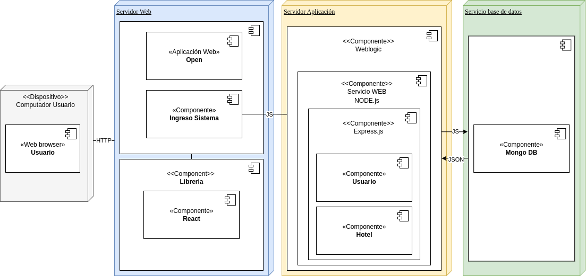

# Linktic FrontEnd Prueba Técnica

Este es un front-end que se conecta al backend, está hecho utilizando React y Vite.

## Descripción

Se realizó un proyecto de reservas de hoteles, para cumplir con la prueba tecnica para LinkTic de desarrollador MD.
El proyecto se realizó utilizando React y Vite para el front-end (Proyecto Actual).

## Diagrama de Arquitectura



## Requisitos previos

- [ ] Node.js (El proyecto fue creado con la versión 20.16.0)
- [ ] Git

## Instalación

Sigue estos pasos para instalar y configurar el proyecto localmente.

1. Clona el repositorio:

   ```bash
   git clone git@github.com:usuario/repositorio.git
   
2. Ubícate en la carpeta del proyecto:
   ```bash
   cd LinkticMDBack-End/
   
3. Ejecuta el comando para instalar las librerías necesarias para ejecutar el proyecto:
   ```bash
   npm ci
4. Ejecuta el comando para correr el proyecto:
   ``bash
   npm run dev ``

   Posteriormente el proyecto se ejecutará y se podrá ver en la url:
   ```bash
   localhost:5173

## Configuración
Dentro de la carpeta principal, se debe crear un archivo `.env` dentro se debe colocar la siguiente información
```bash
VITE_API_URL='URL del Sistema Local'
```
El ejemplo se puede ver en el archivo `.env`

## API y EndPoints

Para conocer todos los end-points que tiene la API puedes entrar en el siguiente [enlace](https://documenter.getpostman.com/view/38032460/2sAXqta1Sx)

